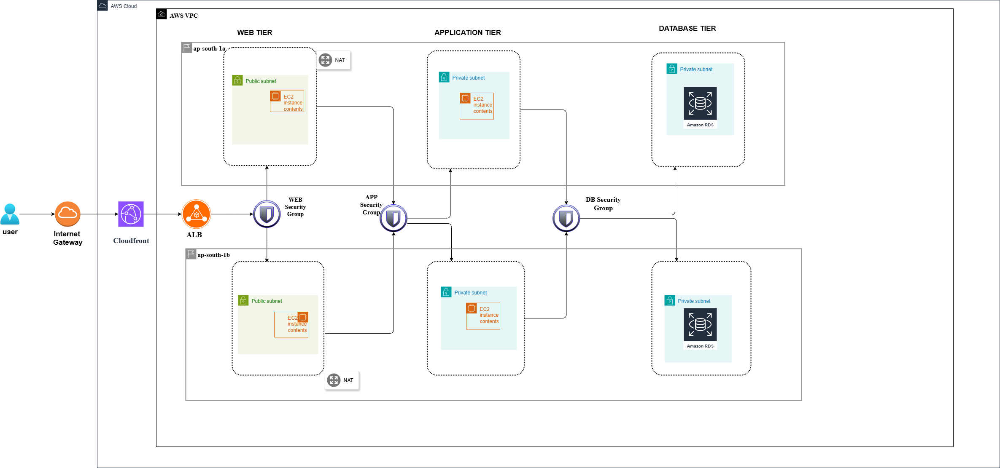

# Terraform Tri Stack

This project showcases how I deployed a highly available **three-tier architecture on AWS** using **Terraform (Infrastructure as Code).**
It demonstrates **modular design, scalability, and security** while following AWS best practices.

---

## 🌐 Project Overview
The project automates deployment of a three-tier architecture: **Web → Application → Database.**
Terraform modules are used for **reusability** and **cleaner code**, implementing **network isolation, load balancing, and secure database access.**

---
## 🌐Project Structure

```text
terraform-three-tier/
├─ modules/
│  ├─ vpc/            # main.tf, variables.tf, outputs.tf, etc.
│  ├─ ec2/            # main.tf, variables.tf, outputs.tf, etc.
│  ├─ rds/            # main.tf, variables.tf, outputs.tf, etc.
│  ├─ alb/            # main.tf, variables.tf, outputs.tf, etc.
│  ├─ security_groups/ # main.tf, variables.tf, outputs.tf, etc.
│  └─ cloudfront/     # main.tf, variables.tf, outputs.tf, etc.
├─ main.tf
├─ variables.tf
├─ provider.tf
└─ terraform.tfvars
```
## Prerequisites
- AWS account
- Terraform installed (v1.x or later)
- AWS CLI installed
- AWS Authentication configured (IAM user with Access Key + Secret Key)  
  👉 See [AWS Authentication](#aws-authentication) for details.

## AWS Authentication

To allow Terraform to provision resources on AWS, this project uses an **IAM user** with programmatic access (Access Key + Secret Key).  

### Setting up AWS credentials
There are multiple ways to provide credentials to Terraform:

1. **Using environment variables**  
```bash
   export AWS_ACCESS_KEY_ID=your_access_key
   export AWS_SECRET_ACCESS_KEY=your_secret_key
   ```

2.  **Using AWS CLI configuration**
  Run the following and enter your keys when prompted:
  ```bash
   aws configure
   ```
3.  **Using a credentials file**
Store your keys in ~/.aws/credentials:
```bash
[default]
aws_access_key_id = your_access_key
aws_secret_access_key = your_secret_key

```
## 🚀Architecture Overview
This project implements a highly available three-tier architecture on AWS, designed for scalability, security, and modularity.

### 1️⃣ High-Level Architecture
	Web Layer: EC2 instances in public subnets behind an Application Load Balancer (ALB). Handles all incoming traffic.
	Application Layer: EC2 instances in private subnets, accessible only through the ALB or a bastion host. Processes business logic.
	Database Layer: RDS instance in a private subnet, secured with security groups allowing access only from the application layer.

### 2️⃣ Network & Traffic Flow
	VPC: Contains public and private subnets across multiple Availability Zones.
	Internet Gateway & NAT Gateway: Provides controlled internet access.
	CloudFront: Delivers content globally with caching and HTTPS.	
	Traffic Flow:
		**User → CloudFront → ALB → Web/App EC2 → RDS (if needed)**

### 3️⃣ Security & Access
	Each layer has its own Security Group.
	Web servers are accessible from the internet; application servers and database are isolated in private subnets.
	Bastion host provides secure admin access to private resources.

### 4️⃣ Scalability & Cost Optimization
	Scalable: ALB supports auto-scaling of EC2 instances; RDS can scale vertically or via read replicas; CloudFront handles global caching.
	Cost-Optimized: Uses micro instances and default CloudFront/ALB domains to minimize expenses during demo/testing.



---

## ⚙️ Implementation Steps

### Step 1: Setup Terraform Project
1) Created a modular Terraform project with separate modules for VPC, EC2, RDS, ALB, Security Groups, and CloudFront.

2) Defined variables for flexibility and outputs for module reuse.

Example: Module call in main.tf
```hcl
module "ec2" {
  source = "./Modules/EC2"
  public_security_group_ids = module.security-group.web-sg-id
  pub1_subnet_id = module.vpc.pub1_subnet_id
  pub2_subnet_id = module.vpc.pub2_subnet_id
  private_security_group_ids = module.security-group.app-sg-id
  prv1_subnet_id = module.vpc.prv1_subnet_id
  prv2_subnet_id = module.vpc.prv2_subnet_id
  db-sg = module.security-group.db-sg-id
}
```
<p align="center">
  
</p>

<br><br>

<p align="center">
  
</p>

<br><br>

<p align="center">
  
</p>

<br><br>

<p align="center">
  
</p>

### Step 2: Deploy Networking Layer
1) Provisioned VPC, public and private subnets, Internet Gateway, and NAT Gateway.

2) Configured route tables for controlled traffic flow.

Example: Public Subnet
```hcl
resource "aws_subnet" "pub1" {

    vpc_id = aws_vpc.vpc1.id
    cidr_block = "10.0.0.0/18"
    availability_zone = "ap-south-1a"
    tags = {
      Name = "Public_sub1"
    }
}
```
<p align="center">
  
</p>

<br><br>

<p align="center">
  
</p>


### Step 3: Configure Security
1) Created Security Groups for:

    ALB → Accepts inbound HTTP traffic from CloudFront only.

    Web Layer → Allows traffic from ALB.

    Application Layer → Accessible only from Web Layer.

    Database Layer (RDS) → Accessible only from Application Layer.

2) Restricted Public Access → Application is accessible only through **CloudFront distribution**, ensuring that EC2 and ALB endpoints are not directly exposed to the internet.

Example: Security Group
```hcl
resource "aws_security_group" "websg"{
    name = "web-security-group"
    description = "allow ssh and http"
    vpc_id = var.vpc_id
}

resource "aws_vpc_security_group_ingress_rule" "inbound2" {
    security_group_id = aws_security_group.websg.id
    from_port = "80"
    referenced_security_group_id = aws_security_group.load.id
    ip_protocol = "tcp"
    to_port = "80"
}

resource "aws_vpc_security_group_egress_rule" "outload" {
  security_group_id = aws_security_group.load.id
  ip_protocol = "-1"
  cidr_ipv4 = "0.0.0.0/0"
}
```

<p align="center">
  
</p>


### Step 4:Web,Application & Database Layer Execution Process
1) Launched **CloudFront** distribution pointing to the **Load Balancer URL** for global content delivery.

2) Launched **EC2 instances** in public subnets behind an **ALB**.

3) Launched **EC2 instances** in private subnets accessible via a **Bastion Host**.

4) Deployed an **RDS instance** in a private subnet with secure access from the application layer only.

Example: EC2 Instance
```hcl
resource "aws_cloudfront_distribution" "cdn" {
  enabled             = true
  default_root_object = "index.html"

  origin {
    domain_name = var.lb_dns   
    origin_id   = "load-origin"

    custom_origin_config {
      http_port              = 80
      https_port             = 443
      origin_protocol_policy = "http-only"   # switch to https-only if ALB listener is HTTPS
      origin_ssl_protocols   = ["TLSv1.2"]
    }
  }

```

### Step 5: TestCases
1. Application Access via CloudFront ✅

    * The application loads successfully through the CloudFront distribution URL, as expected.

<p align="center">
  
</p>

<br><br>

<p align="center">
  
</p>

<br><br>

2. Direct Access via ALB / Web Layer ⚠️

    * Some test cases may show the app not loading directly from the Web or ALB layer.

    * This is expected behavior, because the application is served via CloudFront, which acts as a CDN in front of the ALB for:

    * Improved global performance

    * Caching of content

    * Enhanced security

<p align="center">
  
</p>

<br><br>

<p align="center">
  
</p>

<br><br>

<p align="center">
  
</p>

<br><br>

<p align="center">
  
</p>

<br><br>

3. Security & Access Controls ✅

    * IAM roles and policies enforce restricted access to resources.

<p align="center">
  
</p>

---

## 🔧 Challenges & Lessons Learned
- **Managed state files securely and learned the importance of remote state backends.**
- **Debugged module dependencies to ensure correct resource creation order.**
- **Learned to use tfvars files for storing sensitive details securely.**
- **Adopted modular code best practices for better reusability and scalability.**
---

## 💰 Cost Optimization
- **Used t3.micro EC2 and RDS t3.micro instances to minimize costs in testing.**
- **Avoided extra expenses by using CloudFront’s default domain and skipping SSL certificates during the demo phase.**
- **Designed the architecture to be lightweight yet scalable:**
	- **Scalable** → ALB supports adding/removing EC2s, CloudFront handles global caching, RDS supports
		       scaling vertically and with read replicas.
	- **Lightweight** → Minimal resources (micro instances, no paid services) to keep bills under control.
---

## 🔗 Demo

- **🌐 Application Access → Accessible via ALB DNS endpoint (d2i7sjyohxhhc3.cloudfront.net)**
- **📂 Terraform Project Code → Available in this repository**

- **📝 Note: The application is a simple Apache web server. The focus of this project is on designing and deploying a scalable and secure cloud infrastructure using AWS services and Terraform.**

<p align="center">
  
</p>

---

## 🚀 Future Enhancements
To make the setup more production-ready:

- **Auto Scaling Groups – Automatically adjust app servers based on traffic.**
- **Terraform Remote Backend – Use S3 + DynamoDB for secure and collaborative state management.**
- **CloudWatch Monitoring & Alarms – Enable proactive monitoring and alerts.**
- **CI/CD Pipeline – Use GitHub Actions + Terraform Cloud for automated deployments.**
- **SSL Certificate (ACM) – Secure endpoints with HTTPS and a custom domain.**
- **AWS WAF (Web Application Firewall) – Protect from common web exploits.**
- **Custom Domain Integration – Map CloudFront to a Route 53 domain for better accessibility.**

