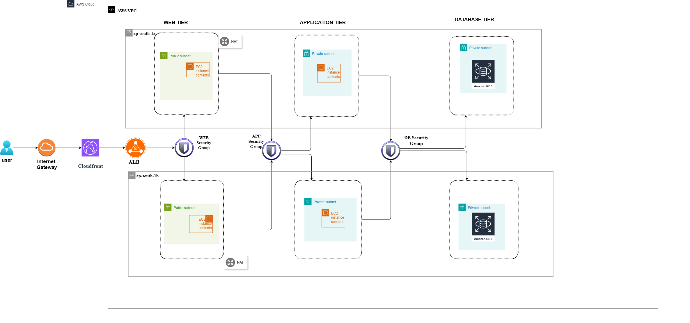

# Terraform Three-Tier Architecture on AWS

This project showcases how I deployed a highly available **three-tier architecture on AWS** using **Terraform (Infrastructure as Code).**
It demonstrates **modular design, scalability, and security** while following AWS best practices.

---

## 🌐 Project Overview
The project automates deployment of a three-tier architecture: **Web → Application → Database.**
Terraform modules are used for **reusability** and **cleaner code**, implementing **network isolation, load balancing, and secure database access.**

---
## 🌐Project Structure

```text
terraform-three-tier/
├─ modules/
│  ├─ vpc/            # main.tf, variables.tf, outputs.tf, etc.
│  ├─ ec2/            # main.tf, variables.tf, outputs.tf, etc.
│  ├─ rds/            # main.tf, variables.tf, outputs.tf, etc.
│  ├─ alb/            # main.tf, variables.tf, outputs.tf, etc.
│  ├─ security_groups/ # main.tf, variables.tf, outputs.tf, etc.
│  └─ cloudfront/     # main.tf, variables.tf, outputs.tf, etc.
├─ main.tf
├─ variables.tf
├─ provider.tf
└─ terraform.tfvars
```

## 🚀Architecture Overview
This project implements a highly available three-tier architecture on AWS, designed for scalability, security, and modularity.

### 1️⃣ High-Level Architecture
	Web Layer: EC2 instances in public subnets behind an Application Load Balancer (ALB). Handles all incoming traffic.
	Application Layer: EC2 instances in private subnets, accessible only through the ALB or a bastion host. Processes business logic.
	Database Layer: RDS instance in a private subnet, secured with security groups allowing access only from the application layer.

### 2️⃣ Network & Traffic Flow
	VPC: Contains public and private subnets across multiple Availability Zones.
	Internet Gateway & NAT Gateway: Provides controlled internet access.
	CloudFront: Delivers content globally with caching and HTTPS.	
	Traffic Flow:
		**User → CloudFront → ALB → Web/App EC2 → RDS (if needed)**

### 3️⃣ Security & Access
	Each layer has its own Security Group.
	Web servers are accessible from the internet; application servers and database are isolated in private subnets.
	Bastion host provides secure admin access to private resources.

### 4️⃣ Scalability & Cost Optimization
	Scalable: ALB supports auto-scaling of EC2 instances; RDS can scale vertically or via read replicas; CloudFront handles global caching.
	Cost-Optimized: Uses micro instances and default CloudFront/ALB domains to minimize expenses during demo/testing.



---

## ⚙️ Implementation Steps

### Step 1: Setup Terraform Project
1) Created a modular Terraform project with separate modules for VPC, EC2, RDS, ALB, Security Groups, and CloudFront.

2) Defined variables for flexibility and outputs for module reuse.

Example: Module call in main.tf
```hcl
module "ec2" {
  source = "./EC2"
  public_security_group_ids = module.security-group.web-sg-id
  pub1_subnet_id = module.vpc.pub1_subnet_id
  pub2_subnet_id = module.vpc.pub2_subnet_id
  private_security_group_ids = module.security-group.app-sg-id
  prv1_subnet_id = module.vpc.prv1_subnet_id
  prv2_subnet_id = module.vpc.prv2_subnet_id
  db-sg = module.security-group.db-sg-id
}
```


### Step 2: Deploy Networking Layer
1) Provisioned VPC, public and private subnets, Internet Gateway, and NAT Gateway.

2) Configured route tables for controlled traffic flow.

Example: Public Subnet
```hcl
resource "aws_subnet" "pub1" {

    vpc_id = aws_vpc.vpc1.id
    cidr_block = "10.0.0.0/18"
    availability_zone = "ap-south-1a"
    tags = {
      Name = "Public_sub1"
    }
}
```
 


### Step 3: Configure Security
1) Created Security Groups for ALB, Web Layer, Application Layer, and Database Layer.

2) Restricted access so that RDS is accessible only from the application layer.

Example: Security Group
```hcl
resource "aws_security_group" "websg"{
    name = "web-security-group"
    description = "allow ssh and http"
    vpc_id = var.vpc_id
}

resource "aws_vpc_security_group_ingress_rule" "inbound2" {
    security_group_id = aws_security_group.websg.id
    from_port = "80"
    #cidr_ipv4 = "0.0.0.0/0"
    referenced_security_group_id = aws_security_group.load.id
    ip_protocol = "tcp"
    to_port = "80"
}
```


### Step 4:Web,Application & Database Layer
1) Launched EC2 instances in public subnets behind ALB.

2) Launched EC2 instances in private subnets for application logic.

3) Deployed RDS instance in private subnet with secure access.

Example: EC2 Instance
```hcl
resource "aws_instance" "bastion-host" {
    instance_type = "t3.micro"
    ami = var.ami_id
    subnet_id = var.pub1_subnet_id
    associate_public_ip_address = true
    key_name = aws_key_pair.key.id
    vpc_security_group_ids = [var.public_security_group_ids]
    root_block_device {
      volume_size = 8
      volume_type = "gp3"
    }
    user_data = file("./EC2/userdata/apache.sh")
    tags = {
      Name = "Bastion-Host1"
    }
}
```

### Step 5: Testing web and application layer
1) Verified application accessibility via ALB DNS.

2) Confirmed database access is restricted to the Application Layer.

3) Validated CloudFront delivery for global content caching.
(4 ss of verification)

---

## 🔧 Challenges & Lessons Learned
- **Managed state files securely and learned the importance of remote state backends.**
- **Debugged module dependencies to ensure correct resource creation order.**
- **Learned to use tfvars files for storing sensitive details securely.**
- **Adopted modular code best practices for better reusability and scalability.**
---

## 💰 Cost Optimization
- **Used t3.micro EC2 and RDS t3.micro instances to minimize costs in testing.**
- **Avoided extra expenses by using CloudFront’s default domain and skipping SSL certificates during the demo phase.**
- **Designed the architecture to be lightweight yet scalable:**
	- **Scalable** → ALB supports adding/removing EC2s, CloudFront handles global caching, RDS supports
		       scaling vertically and with read replicas.
	- **Lightweight** → Minimal resources (micro instances, no paid services) to keep bills under control.
---

## 🚀 Future Enhancements
To make the setup more production-ready:

- **Auto Scaling Groups – Automatically adjust app servers based on traffic.**
- **Terraform Remote Backend – Use S3 + DynamoDB for secure and collaborative state management.**
- **CloudWatch Monitoring & Alarms – Enable proactive monitoring and alerts.**
- **CI/CD Pipeline – Use GitHub Actions + Terraform Cloud for automated deployments.**
- **SSL Certificate (ACM) – Secure endpoints with HTTPS and a custom domain.**
- **AWS WAF (Web Application Firewall) – Protect from common web exploits.**
- **Custom Domain Integration – Map CloudFront to a Route 53 domain for better accessibility.**

---

## 🔗 Demo

- **🌐 Application Access → Accessible via ALB DNS endpoint (d3d0y3lhl1dt40.cloudfront.net)**
- **📂 Terraform Project Code → Available in this repository**

- **📝 Note: The application is a simple Apache web server. The focus of this project is on designing and deploying a scalable and secure cloud infrastructure using AWS services and Terraform.**


